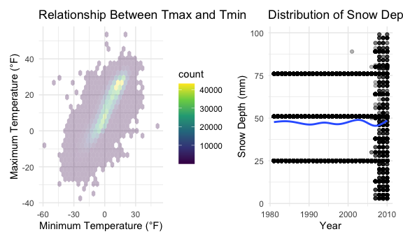

HW3 Visualization and EDA
================
Minghui Wang
2024-10-10

[Homework 3](https://p8105.com/homework_3.html) reinforces ideas in
Visualization and
[EDA](https://p8105.com/topic_visualization_and_eda.html). Here are the
codes focusing on question 1-3.

# Question1

## Import the data:

``` r
library(p8105.datasets)
data("ny_noaa")
```

## EDA and descriptionn

``` r
ny_noaa|>
  head() |>
  knitr::kable()
```

| id          | date       | prcp | snow | snwd | tmax | tmin |
|:------------|:-----------|-----:|-----:|-----:|:-----|:-----|
| US1NYAB0001 | 2007-11-01 |   NA |   NA |   NA | NA   | NA   |
| US1NYAB0001 | 2007-11-02 |   NA |   NA |   NA | NA   | NA   |
| US1NYAB0001 | 2007-11-03 |   NA |   NA |   NA | NA   | NA   |
| US1NYAB0001 | 2007-11-04 |   NA |   NA |   NA | NA   | NA   |
| US1NYAB0001 | 2007-11-05 |   NA |   NA |   NA | NA   | NA   |
| US1NYAB0001 | 2007-11-06 |   NA |   NA |   NA | NA   | NA   |

``` r
ny_noaa|>
  dim()
```

    ## [1] 2595176       7

``` r
 ny_noaa |>
  group_by(id) |> 
  summarize(
    n_obs = n())|> 
  arrange(n_obs)
```

    ## # A tibble: 747 × 2
    ##    id          n_obs
    ##    <chr>       <int>
    ##  1 US1NYCN0011    30
    ##  2 US1NYES0005    30
    ##  3 US1NYSF0030    30
    ##  4 US1NYDT0007    31
    ##  5 US1NYSF0049    31
    ##  6 US1NYST0033    31
    ##  7 US1NYWC0009    31
    ##  8 USC00306411    31
    ##  9 USC00303076    59
    ## 10 USC00304525    59
    ## # ℹ 737 more rows

``` r
 ny_noaa |>
  ggplot(aes(x = prcp)) +
  geom_histogram()
```

    ## Warning: Removed 145838 rows containing non-finite outside the scale range
    ## (`stat_bin()`).


``` r
 ny_noaa |>
  ggplot(aes(x = snwd)) +
  geom_histogram()
```

    ## Warning: Removed 591786 rows containing non-finite outside the scale range
    ## (`stat_bin()`).


``` r
 ny_noaa |>
   filter( snwd >= 50)|>
  ggplot(aes(x = snwd)) +
  geom_histogram()
```


``` r
ny_noaa_df = ny_noaa |>
  mutate(
    tmax = as.numeric(tmax) / 10, 
    tmin = as.numeric(tmin) / 10
  ) 

 ny_noaa_df |>
  ggplot(aes(x = tmax)) +
  geom_histogram()
```

    ## Warning: Removed 1134358 rows containing non-finite outside the scale range
    ## (`stat_bin()`).


``` r
 ny_noaa_df |>
  ggplot(aes(x = tmin)) +
  geom_histogram()
```

    ## Warning: Removed 1134420 rows containing non-finite outside the scale range
    ## (`stat_bin()`).


## Data description

This dataset has 7 variables recording 2595176 entries.The data records
different cities’ weather information, including key variables like
date, precipitation and snow condition, snow day, maxium and mininum
temperature at that day.After EDA, we find tha precipitation and snow
are very skewed distribution; any formal analyses involving them as a
predictor or outcome might be influenced by this fact. It’s important to
note that the vast majority of days have no precipitation or snow.
Meanwhile, examining the relatively few days have very high
precipitation and snow might be helpful.

## Answer questions

1.  Do some data cleaning. Create separate variables for year, month,
    and day. Ensure observations for temperature, precipitation, and
    snowfall are given in reasonable units.

``` r
ny_noaa_cleaned_df =
  ny_noaa_df |> # already change the variable type of tin and tmax in EDA steps.
  drop_na(prcp) |>
  mutate(
    year = year(date) ,
    month = month(date),
    day = day(date)
  ) |> view()
```

For snowfall, what are the most commonly observed values? Why?

2.  Make a two-panel plot showing the average max temperature in January
    and in July in each station across years. Is there any observable /
    interpretable structure? Any outliers?

``` r
ny_noaa_cleaned_df |>
  filter(month %in% c(1, 7)) |>
  group_by(id, year, month)|>
  summarize(
    mean_tmax = mean(tmax, na.rm = TRUE)) |>
  mutate(
    month_name = case_match(
      month,
      1 ~ "January",
      7 ~ "July"
    )  ) |>
  ggplot(aes(x = year, y = mean_tmax)) + 
  geom_point(alpha = .3) + 
  geom_line()+ 
  facet_grid(. ~ month_name)+
  labs(
    x = "Year", 
    y = "Mean Maximum Temp (C)",
    title = "Average Max Temperature in January and in July in Each Station Across Years",
  ) + 
  theme_minimal() + 
  theme(legend.position = "bottom")
```

    ## `summarise()` has grouped output by 'id', 'year'. You can override using the
    ## `.groups` argument.

    ## Warning: Removed 5911 rows containing missing values or values outside the scale range
    ## (`geom_point()`).


3.  Make a two-panel plot showing

<!-- -->

1)  tmax vs tmin for the full dataset (note that a scatterplot may not
    be the best option);
2)  make a plot showing the distribution of snowfall values greater than
    0 and less than 100 separately by year.

``` r
ggp_tmax_tmin = 
ny_noaa_cleaned_df |> 
  drop_na(tmax, tmin) |>
  ggplot(aes(x = tmin, y = tmax)) + 
  geom_hex(alpha = .3)+
  labs(
    x = "Minimum Temperature (°F)",
    y = "Maximum Temperature (°F)",
    title = "Relationship Between Tmax and Tmin"
  ) +
  theme_minimal()

ggp_snwd_yr =
  ny_noaa_cleaned_df |> 
  filter(snwd > 0 & snwd < 100) |> 
  ggplot(aes(x = year, y = snwd)) + 
  geom_point(alpha = .3) + 
  geom_smooth(se = FALSE)+
  labs(
    x = "Year",
    y = "Snow Depth (mm)",
    title = "Distribution of Snow Depth for Values Between 0 and 100 mm by Year"
  ) +
  theme_minimal()

ggp_tmax_tmin + ggp_snwd_yr 
```

    ## `geom_smooth()` using method = 'gam' and formula = 'y ~ s(x, bs = "cs")'


