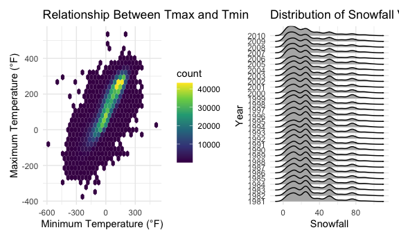
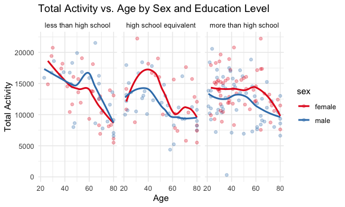
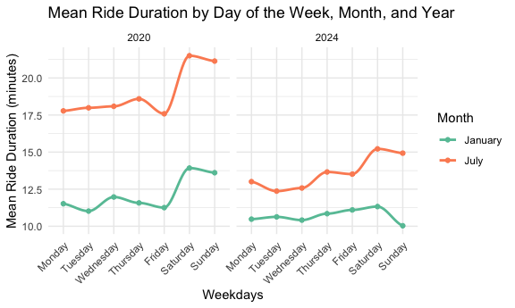

HW3 Visualization and EDA
================
Minghui Wang
2024-10-16

[Homework 3](https://p8105.com/homework_3.html) reinforces ideas in
Visualization and
[EDA](https://p8105.com/topic_visualization_and_eda.html). Here are the
codes focusing on question 1-3.

Load packages:

``` r
library(patchwork)
library(ggridges)
library(hexbin)
library(tidyverse)
```

    ## ── Attaching core tidyverse packages ──────────────────────── tidyverse 2.0.0 ──
    ## ✔ dplyr     1.1.4     ✔ readr     2.1.5
    ## ✔ forcats   1.0.0     ✔ stringr   1.5.1
    ## ✔ ggplot2   3.5.1     ✔ tibble    3.2.1
    ## ✔ lubridate 1.9.3     ✔ tidyr     1.3.1
    ## ✔ purrr     1.0.2     
    ## ── Conflicts ────────────────────────────────────────── tidyverse_conflicts() ──
    ## ✖ dplyr::filter() masks stats::filter()
    ## ✖ dplyr::lag()    masks stats::lag()
    ## ℹ Use the conflicted package (<http://conflicted.r-lib.org/>) to force all conflicts to become errors

# Question1

## Import the data:

``` r
library(p8105.datasets)
data("ny_noaa")
```

## EDA and description

``` r
ny_noaa|>
  head() |>
  knitr::kable()
```

| id          | date       | prcp | snow | snwd | tmax | tmin |
|:------------|:-----------|-----:|-----:|-----:|:-----|:-----|
| US1NYAB0001 | 2007-11-01 |   NA |   NA |   NA | NA   | NA   |
| US1NYAB0001 | 2007-11-02 |   NA |   NA |   NA | NA   | NA   |
| US1NYAB0001 | 2007-11-03 |   NA |   NA |   NA | NA   | NA   |
| US1NYAB0001 | 2007-11-04 |   NA |   NA |   NA | NA   | NA   |
| US1NYAB0001 | 2007-11-05 |   NA |   NA |   NA | NA   | NA   |
| US1NYAB0001 | 2007-11-06 |   NA |   NA |   NA | NA   | NA   |

``` r
ny_noaa|>
  dim()
```

    ## [1] 2595176       7

``` r
 ny_noaa |>
  group_by(id) |> 
  summarize(
    n_obs = n())|> 
  arrange(n_obs)
```

    ## # A tibble: 747 × 2
    ##    id          n_obs
    ##    <chr>       <int>
    ##  1 US1NYCN0011    30
    ##  2 US1NYES0005    30
    ##  3 US1NYSF0030    30
    ##  4 US1NYDT0007    31
    ##  5 US1NYSF0049    31
    ##  6 US1NYST0033    31
    ##  7 US1NYWC0009    31
    ##  8 USC00306411    31
    ##  9 USC00303076    59
    ## 10 USC00304525    59
    ## # ℹ 737 more rows

``` r
 ny_noaa |>
  ggplot(aes(x = prcp)) +
  geom_histogram()
```

    ## Warning: Removed 145838 rows containing non-finite outside the scale range
    ## (`stat_bin()`).


``` r
 ny_noaa |>
  ggplot(aes(x = snwd)) +
  geom_histogram()
```

    ## Warning: Removed 591786 rows containing non-finite outside the scale range
    ## (`stat_bin()`).


``` r
 ny_noaa |>
   filter( snwd >= 50)|>
  ggplot(aes(x = snwd)) +
  geom_histogram()
```


``` r
ny_noaa_df = ny_noaa |>
  mutate(
    tmax = as.numeric(tmax), 
    tmin = as.numeric(tmin)
  ) 

 ny_noaa_df |>
  ggplot(aes(x = tmax)) +
  geom_histogram()
```

    ## Warning: Removed 1134358 rows containing non-finite outside the scale range
    ## (`stat_bin()`).


``` r
 ny_noaa_df |>
  ggplot(aes(x = tmin)) +
  geom_histogram()
```

    ## Warning: Removed 1134420 rows containing non-finite outside the scale range
    ## (`stat_bin()`).


## Data description

This dataset has 7 variables recording 2595176 entries.The data records
different cities’ weather information, including key variables like
date, precipitation and snow condition, snow day, maxium and mininum
temperature at that day.After EDA, we find that precipitation and snow
are very skewed distribution; any formal analyses involving them as a
predictor or outcome might be influenced by this fact. It’s important to
note that the vast majority of days have no precipitation or snow.
Meanwhile, examining the relatively few days have very high
precipitation and snow might be helpful.

## Answer questions

1.  Do some data cleaning. Create separate variables for year, month,
    and day. Ensure observations for temperature, precipitation, and
    snowfall are given in reasonable units.

``` r
ny_noaa_cleaned_df =
  ny_noaa_df |> # already change the variable type of tin and tmax in EDA steps.
  drop_na(prcp) |>
  mutate(
    year = year(date) ,
    month = month(date),
    day = day(date)
  ) 
```

- For snowfall, what are the most commonly observed values? Why?
  - For snowfall, the most commonly observed value are “NA” or zero for
    it is not common the be snowy alot in New York.

2.  Make a two-panel plot showing the average max temperature in January
    and in July in each station across years.

``` r
ny_noaa_cleaned_df |>
  filter(month %in% c(1, 7)) |>
  group_by(id, year, month)|>
  summarize(
    mean_tmax = mean(tmax, na.rm = TRUE)) |>
  mutate(
    month_name = case_match(
      month,
      1 ~ "January",
      7 ~ "July"
    )  ) |>
  ggplot(aes(x = year, y = mean_tmax)) + 
  geom_point(alpha = .3) + 
  geom_path()+ 
  facet_grid(. ~ month_name)+
  labs(
    x = "Year", 
    y = "Mean Maximum Temp (C)",
    title = "Average Max Temperature in January and in July in Each Station Across Years",
  ) + 
  theme_minimal() + 
  theme(legend.position = "bottom")
```

    ## `summarise()` has grouped output by 'id', 'year'. You can override using the
    ## `.groups` argument.

    ## Warning: Removed 5911 rows containing missing values or values outside the scale range
    ## (`geom_point()`).

    ## Warning: Removed 1451 rows containing missing values or values outside the scale range
    ## (`geom_path()`).

 -
Is there any observable / interpretable structure? Any outliers? - Yes.
The plot shows that July has higher average maximum temperatures than
January over the years, which is expected. There is no big change in
temperature trends over time, which suggests stable patterns for these
months. However, there are some unusual points, especially in January,
where temperatures drop much lower than the others. This might mean
there were very cold days or maybe data mistakes. In July, there are
fewer unusual points, but one or two cooler days stand out. These
unusual points should be checked further to see if they are correct.

3.  Make a two-panel plot showing

<!-- -->

1)  tmax vs tmin for the full dataset (note that a scatterplot may not
    be the best option);
2)  make a plot showing the distribution of snowfall values greater than
    0 and less than 100 separately by year.

``` r
ggp_tmax_tmin = 
ny_noaa_cleaned_df |> 
  drop_na(tmax, tmin) |>
  ggplot(aes(x = tmin, y = tmax)) + 
  geom_hex()+
  labs(
    x = "Minimum Temperature (°F)",
    y = "Maximum Temperature (°F)",
    title = "Relationship Between Tmax and Tmin"
  ) +
  theme_minimal()

ggp_snow_yr =
  ny_noaa_cleaned_df |> 
  filter(snow > 0 & snow < 100) |> 
  ggplot(aes(x = snow, y = as.factor(year))) + 
  geom_density_ridges()+
  labs(
    x = "Snowfall",
    y = "Year",
    title = "Distribution of Snowfall Values Between 0 and 100 mm by Year"
  ) +
  theme_minimal()

ggp_tmax_tmin + ggp_snow_yr 
```

    ## Picking joint bandwidth of 3.8



# Question 2

## 2.1 Load, tidy, merge the datasets

``` r
# Load, tidy the demographic df
accel_demo_df =
  read.csv("data/nhanes_covar.csv",skip = 4, na = c("NA", ".","")) |>
  janitor::clean_names()|>
  # exclude participants less than 21 years of age
  filter(age >= 21)|>
  # exclude  those with missing demographic data
  drop_na()|>
  # encode data with reasonable variable classes
  mutate(
    sex = as.character(sex),        
    sex = case_match(
      sex,
      "1" ~ "male",
      "2" ~ "female"
    ),
    education = as.character(education), 
    education = case_match(
      education,
      "1" ~ "less than high school",
      "2" ~ "high school equivalent",
      "3" ~ "more than high school"
    )
  )

# Load, tidy the Variables df
accel_var_df =
  read.csv("data/nhanes_accel.csv", na = c("NA", ".","")) |>
  janitor::clean_names()|>
  pivot_longer(
    cols = min1:min1440, 
    names_to = "minute",
    values_to = 'mims_value',
  )|>
  mutate(minute = as.numeric(sub("min", "", minute))) 

# Merge to table based on demographic df
accel_df =
  left_join(accel_demo_df, accel_var_df, by = "seqn")
```

## 2.2 Demographic table

### 2.2.1 Table for the number of men and women in each education category

``` r
accel_df |>  
  group_by(sex, education) |>
  summarize(category_count = n()/1440, .groups = "drop")|>  
  pivot_wider(
    names_from = education,
    values_from  = category_count
    ) |>
  knitr::kable()
```

| sex    | high school equivalent | less than high school | more than high school |
|:-------|-----------------------:|----------------------:|----------------------:|
| female |                     23 |                    28 |                    59 |
| male   |                     35 |                    27 |                    56 |

### 2.2.2 Visualization of the age distributions for men and women in each education category

``` r
accel_df |>  
  mutate(education = factor(education, levels = c("less than high school", 
                                                  "high school equivalent", 
                                                  "more than high school"))) |>
  ggplot(aes(x = sex, y=age, fill = education)) + 
  geom_boxplot() +
  labs(title = "Age Distributions by Sex and Education Level",
      x = "Sex",
      y = "Age") +
  scale_y_continuous(
    limits = c(20, 85),
    breaks = c(20,30,40,50,60,70,80)
  )+
  scale_fill_brewer(palette = "Set3") +
  theme_minimal()
```


- Comment on these items: This box plot shows the age distributions for
  men and women in different education categories. For both men and
  women, those with “more than high school” seem to have a slightly
  younger age range compared to the other two education levels. The
  median ages for “high school equivalent” are a bit higher for females
  whild for man ages for “high school equivalent” are a bit lower.

## 2.3 Total activity variable

Using your tidied dataset, aggregate across minutes to create a total
activity variable for each participant. Plot these total activities
(y-axis) against age (x-axis); your plot should compare men to women and
have separate panels for each education level. Include a trend line or a
smooth to illustrate differences. Comment on your plot.

``` r
accel_df |>  
  mutate(education = factor(education, levels = c("less than high school", 
                                                  "high school equivalent", 
                                                  "more than high school"))
         ) |>
  # Create a total activity variable for each participant
  group_by(seqn, sex, age, education) |>
  summarize(total_activities = sum(mims_value, na.rm = TRUE))|>
  # Age-total_activity plot compare men to women 
  ggplot(aes(x = age, y=total_activities, color = sex)) + 
  geom_point(alpha=.3) +
  # Include a trend line or a smooth to illustrate differences
  geom_smooth(se = FALSE) +
  # Have separate panels for each education level
  facet_grid(. ~ education)+ 
  labs(title = "Total Activity vs. Age by Sex and Education Level",
       x = "Age",
       y = "Total Activity") +
  scale_color_brewer(palette = "Set1")+
  theme_minimal()
```

    ## `summarise()` has grouped output by 'seqn', 'sex', 'age'. You can override
    ## using the `.groups` argument.
    ## `geom_smooth()` using method = 'loess' and formula = 'y ~ x'

 -
Comments: This plot shows total activity levels by age for men and women
across three education levels. In the “less than high school” group,
activity decreases with age, especially for men. The “high school
equivalent” group has more ups and downs in activity, while the “more
than high school” group shows steadier activity across ages. Women
generally have slightly higher activity in younger ages across all
levels. Among “high school equivalent” and “more than high school”
group, women consistantly have more daily activity than men across all
ages.

## 2.4 Activity over the course of the day

- Make a three-panel plot that shows the 24-hour activity time courses
  for each education level and use color to indicate sex. Including
  smooth trends may help identify differences.

``` r
accel_df |>  
  mutate(education = factor(education, levels = c("less than high school", 
                                                  "high school equivalent", 
                                                  "more than high school"))
         ) |>
  # 24-hour activity time courses comparinng men to women 
  group_by(minute, sex, education) |>
  summarize(mean_activities = mean(mims_value, na.rm = TRUE))|>
  ggplot(aes(x = minute, y=mean_activities, color = sex)) + 
  geom_point(alpha=.3) +
  # Include a trend line or a smooth to illustrate differences
  geom_smooth(se = FALSE) +
  # Have separate panels for each education level
  facet_grid(~ education) +
  scale_x_continuous(breaks = seq(0, 1440, by = 240), 
                     labels = c("12 AM", "4 AM", "8 AM", "12 PM", "4 PM", "8 PM", "12 AM")) +
  labs(title = "24-Hour Activity Time Courses by Education Level and Sex",
       x = "Time of Day",
       y = "Mean Activity Level") +
  scale_color_brewer(palette = "Set1")+
  theme_minimal()+
  theme(legend.position = "bottom")
```

    ## `summarise()` has grouped output by 'minute', 'sex'. You can override using the
    ## `.groups` argument.
    ## `geom_smooth()` using method = 'gam' and formula = 'y ~ s(x, bs = "cs")'


- Describe in words any patterns or conclusions can make based on this
  graph: Across all three education levels, activity levels are low
  around midnight, increase sharply starting around 6 AM, and reach a
  peak around noon to 4 PM. Activity then decreases steadily in the
  evening, reaching low levels again by midnight. In each education
  category, women generally have higher activity levels than men
  throughout the day, with the largest differences occurring during peak
  activity hours. The activity patterns are similar across education
  levels, suggesting that daily routines are consistent regardless of
  education. However, the “less than high school” group shows slightly
  higher peaks in activity compared to the other groups. \# Question 3
  \## 3.1 Import, clean, and tidy data

``` r
# Load, tidy the demographic df
citi_2020_01_df =
  read.csv("data/citibike/Jan 2020 Citi.csv", na = c("NA", ".","")) |>
  janitor::clean_names() |>
  mutate(
    month = "January",
    year = 2020
  )

citi_2024_01_df =
  read.csv("data/citibike/Jan 2024 Citi.csv", na = c("NA", ".","")) |>
  janitor::clean_names() |>
  mutate(
    month = "January",
    year = 2024
  )

citi_2020_07_df =
  read.csv("data/citibike/July 2020 Citi.csv", na = c("NA", ".","")) |>
  janitor::clean_names() |>
  mutate(
    month = "July",
    year = 2020
  )

citi_2024_07_df =
  read.csv("data/citibike/July 2024 Citi.csv", na = c("NA", ".","")) |>
  janitor::clean_names() |>
  mutate(
    month = "July",
    year = 2024
  )

citi_total_df = 
  bind_rows(citi_2020_01_df, citi_2020_07_df,citi_2024_01_df, citi_2024_07_df)|> 
  relocate(month, year)
```

## 3.2 Import, clean, and tidy data

Produce a reader-friendly table showing the total number of rides in
each combination of year and month separating casual riders and Citi
Bike members. Comment on these results.

``` r
citi_total_df|> 
  group_by(year, month,member_casual) |> 
  summarize(
    n_obs = n()) |>
  pivot_wider(
    names_from = member_casual,
    values_from = n_obs
  )|>
  arrange(year, month) |>
  knitr::kable()
```

    ## `summarise()` has grouped output by 'year', 'month'. You can override using the
    ## `.groups` argument.

| year | month   | casual | member |
|-----:|:--------|-------:|-------:|
| 2020 | January |    984 |  11436 |
| 2020 | July    |   5637 |  15411 |
| 2024 | January |   2108 |  16753 |
| 2024 | July    |  10894 |  36262 |

This table shows that both casual riders and Citi Bike members take more
rides in July than in January, likely due to warmer weather. From 2020
to 2024, there’s a noticeable increase in rides for both groups,
especially in July. Casual rides in July more than doubled, and member
rides also saw a big jump, indicating that more people are using Citi
Bike over time. Members consistently have a high number of rides even in
January, suggesting they use Citi Bike regularly, possibly for
commuting.

## 3.3 Five most popular starting stations for July 2024

Make a table showing the 5 most popular starting stations for July 2024;
include the number of rides originating from these stations.

``` r
citi_2024_07_df|> 
  group_by(start_station_name) |> 
  summarize(
    n_start_count = n()) |>
  mutate(rank = dense_rank(desc(n_start_count))) |>  
  filter(rank <= 5) |>
  arrange(desc(n_start_count)) |>
  knitr::kable()
```

| start_station_name       | n_start_count | rank |
|:-------------------------|--------------:|-----:|
| Pier 61 at Chelsea Piers |           163 |    1 |
| University Pl & E 14 St  |           155 |    2 |
| W 21 St & 6 Ave          |           152 |    3 |
| West St & Chambers St    |           150 |    4 |
| W 31 St & 7 Ave          |           146 |    5 |

In July 2024, the most popular starting stations were Pier 61 at Chelsea
Piers with 163 rides, followed by University Pl & E 14 St with 155
rides, W 21 St & 6 Ave with 152 rides, West St & Chambers St with 150
rides, and W 31 St & 7 Ave with 146 rides.

## 3.4 Effects of day of the week, month, and year on median ride duration

Make a plot to investigate the effects of day of the week, month, and
year on median ride duration. This plot can include one or more panels,
but should facilitate comparison across all variables of interest.

``` r
citi_total_df|> 
  group_by(year, month, weekdays) |> 
  mutate(weekdays = factor(weekdays, levels = c("Monday", "Tuesday", "Wednesday", "Thursday", "Friday", "Saturday", "Sunday")))|> 
  summarize(
    mean_rids = mean(duration, na.rm = TRUE)) |>
  ggplot(aes(x = weekdays, y = mean_rids, color = month, group = interaction(year, month))) + 
  geom_point() + 
  geom_smooth(se = FALSE, method = "loess", span = 0.5)+
  facet_grid(. ~ year)+
  scale_color_brewer(palette = "Set2") +  # Improved color distinction
  labs(
    title = "Mean Ride Duration by Day of the Week, Month, and Year",
    x = "Weekdays",
    y = "Mean Ride Duration (minutes)",
    color = "Month"
  ) +
  theme_minimal() +
  theme(axis.text.x = element_text(angle = 45, hjust = 1))  
```

    ## `summarise()` has grouped output by 'year', 'month'. You can override using the
    ## `.groups` argument.
    ## `geom_smooth()` using formula = 'y ~ x'


In both 2020 and 2024, July has higher ride durations, especially on
weekends, with the longest rides happening on Sundays. This likely
reflects more leisure riding in warmer weather. January, on the other
hand, has shorter and more stable ride durations across the week,
probably due to colder weather and less outdoor biking activity. The
trend is quite similar between the two years, but overall durations in
2020 seem a bit higher, which might mean people are taking longer rides
over time. Weekdays in both months are fairly stable, suggesting
consistent commuting patterns.

## 3.5 Impact of month, membership status, and bike type on the distribution of ride duration

There were relatively few electric Citi Bikes in 2020, but many more are
available now. For data in 2024, make a figure that shows the impact of
month, membership status, and bike type on the distribution of ride
duration.

``` r
citi_total_df |>
  filter(year == 2024) |>
  ggplot(aes(x = month, y = duration, fill = member_casual)) +
  geom_violin(trim = TRUE, scale = "width", alpha = 0.7, adjust = 0.8) + 
  facet_grid(. ~ rideable_type) + 
  scale_fill_brewer(palette = "Pastel1") +
  labs(
    title = "Ride Duration by Month, Membership, and Bike Type (2024)",
    x = "Month",
    y = "Ride Duration (minutes)",
    fill = "Membership Status"
  ) +
  theme_minimal(base_size = 14) +
  theme(
    plot.title = element_text(hjust = 0.5, face = "bold"),
    legend.position = "top",
  )
```


Overall, electric bikes tend to have longer ride durations than classic
bikes, especially for casual riders. Casual riders generally have longer
and more varied ride durations compared to members. In January, ride
durations are shorter across both bike types and membership statuses,
while in July, rides are longer, especially for casual riders using
classic bikes. There are also some very long rides for casual riders on
electric bikes in July, which might be outliers or rides used for more
recreational purposes.
